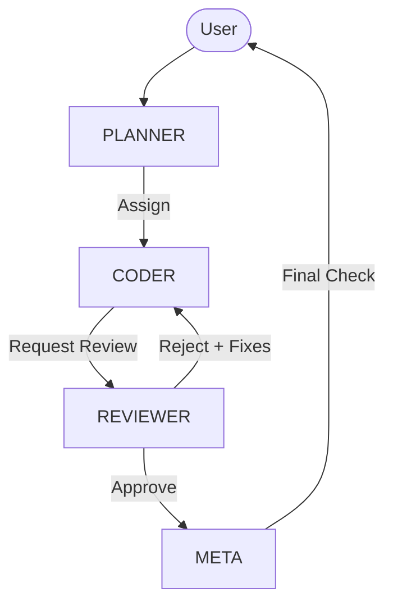

# Topology & Collaboration Policy
*Defining the permitted pathways of agent communication.*

## Purpose
This topology ensures that agents interact in a predictable, governed manner. It prevents "loops" and ensures that every piece of code passes through a review gate.

## Purpose
Defines the valid communication paths between roles to prevent "Hallucination Loops" and "Authority Leaks."

## The Flow (Directed Acyclic Graph)

## Constraints
1.  **No Self-Approval:** A Coder cannot approve their own code.
2.  **No Bypass:** A Coder cannot go straight to Meta (must pass Reviewer).
3.  **Adversarial Injection:** `RED-TEAM` sits outside the loop and injects failure scenarios into `REVIEWER`.