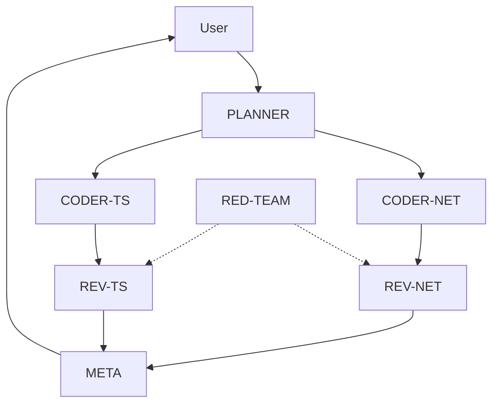

# Allowed Edges

## Purpose
Defines the permitted communication flow between roles.

## Flow Diagram

## Authorized Interactions

### 1. Assignment (Downstream)
*   `PLANNER` -> `CODER-NET` (Assign Task)
*   `PLANNER` -> `CODER-TS` (Assign Task)

### 2. Review (Horizontal)
*   `CODER-NET` -> `REV-NET` (Request Review)
*   `CODER-TS` -> `REV-TS` (Request Review)

### 3. Governance (Upstream)
*   `REV-NET` -> `META` (Submit Findings)
*   `REV-TS` -> `META` (Submit Findings)

### 4. Adversarial (Injection)
*   `RED-TEAM` -> `REV-NET` (Inject Vulnerability Report)
*   `RED-TEAM` -> `REV-TS` (Inject Vulnerability Report)